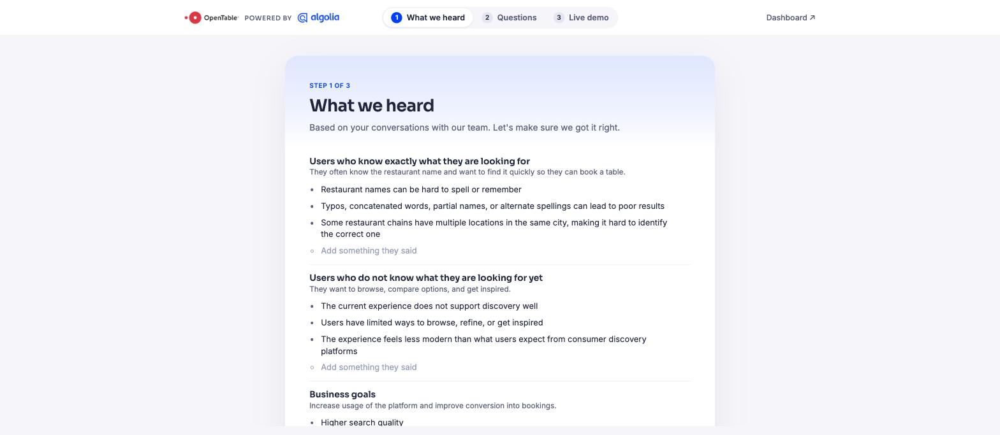
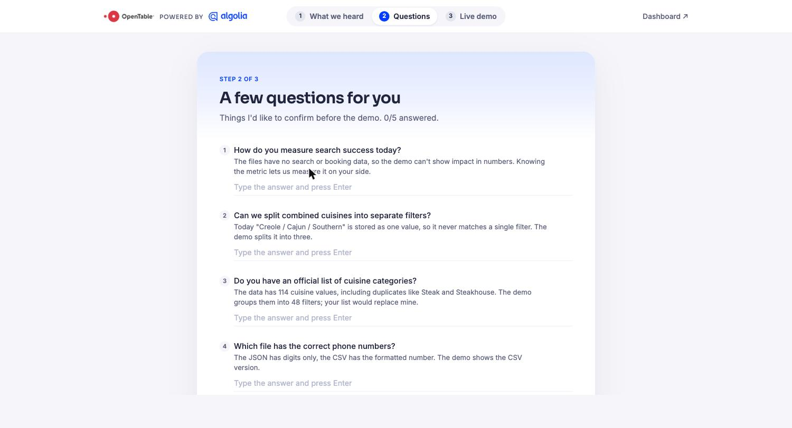
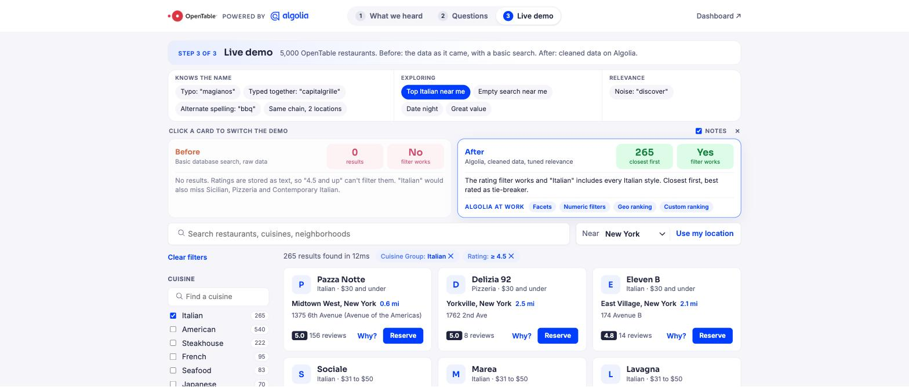
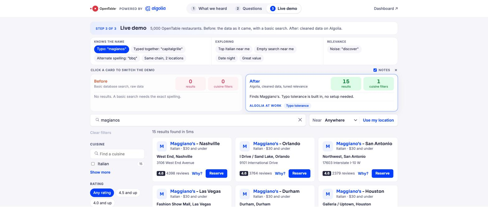

# OpenTable search demo, powered by Algolia

Take-home project for the Solutions Engineer role at Algolia.

**The brief:** OpenTable wants better restaurant search and discovery for two kinds
of users (people who know the restaurant name, and people who want to explore)
and one business goal: more bookings coming from search.

**Live demo:** [Vercel URL]

## How the demo is built

It is a short customer walkthrough in three steps, the way I would run a first
demo call.

### Step 1. What we heard

The pain points and goals from the discovery notes, in the prospect's own words.
Every bullet is editable during the call, so we align on the problem before
showing anything.



### Step 2. Questions

Five things I found in the data that only OpenTable can answer: how they measure
search success, combined cuisines, an official cuisine list, which file has the
right phone numbers, and which price field to trust. Each question states what
the files show today and what the demo does about it. Answers are saved as you
type.



### Step 3. Live demo

5,000 real OpenTable restaurants with nine scenarios and a Before / After switch.

- **Before** is the data exactly as delivered, searched with a basic
  database-style match: substring, no typo tolerance, no synonyms, no ranking,
  exact filters only. It is a small simulator in the front end, not Algolia.
- **After** is the cleaned data on Algolia with tuned relevance.

Both sides answer the same query and filters, so the numbers are comparable.



## Scenarios and results

Each scenario maps to a persona from the brief. Numbers are what the two sides
return for the same query and filters.

| Scenario | Persona | Before | After | Algolia at work |
|---|---|---|---|---|
| Typo: "magianos" | Knows the name | 0 results | 15 Maggiano's | Typo tolerance |
| Typed together: "capitalgrille" | Knows the name | 0 | 11 Capital Grille | Word splitting |
| Alternate spelling: "bbq" | Knows the name | 4 | 26 (Barbecue cuisine included) | Synonyms |
| Same chain, two locations | Knows the name | 0 | 2, closest first | Geo ranking, enriched records |
| Top Italian near me (4.5+) | Exploring | 0, rating filter ignored | 265, closest first | Facets, numeric filters, geo |
| Empty search near me | Exploring | 5,000 in file order | 5,000, closest and best rated first | Geo + custom ranking |
| Date night (fine dining, 4.5+) | Exploring | 0 | 349 | Facets, numeric filters |
| Great value ($30 and under, 4.5+) | Exploring | 0 | 774 | Facets, numeric filters |
| Noise: "discover" | Relevance | 4,102 (matches the Discover card) | 0 | Searchable attributes |



## Data decisions

The two files (`restaurants_list.json` and `restaurants_info.csv`) were joined on
`objectID`. What I found and what I did about it:

| Found | Decision |
|---|---|
| 114 distinct cuisine values, with duplicates ("Steak" / "Steakhouse") and combined values ("Creole / Cajun / Southern") | Renamed duplicates, split combined values into separate cuisines, and grouped the result into 48 filter groups (`cuisine_group`). The original cuisine stays on the record and on the card. |
| Ratings and review counts stored as text in the CSV | Converted to numbers, so they can be filtered ("4.5 and up") and used for ranking. A text rating is why the Before side returns nothing for those scenarios. |
| Phone numbers differ between the files (digits only vs formatted) | Kept the formatted CSV version. |
| The 1–4 `price` level and the `price_range` text disagree for 220 restaurants | The filter uses `price_range`, since that is what diners read. Flagged as a question for OpenTable. |
| `_geoloc` present in the JSON | Powers "near me": closest first, with ties within 8 km broken by rating. |

## Relevance configuration

Everything lives in `config/` so the setup is reproducible. The same settings
can be made in the Algolia dashboard.

`config/index-settings.json`

- **searchableAttributes:** `name`, `cuisine`, `neighborhood, city`, then `area`
  and `address` (unordered). Payment options and URLs are not searchable, which is
  why "discover" stops matching the credit card.
- **customRanking:** `desc(stars_count)`, `desc(reviews_count)`.
- **attributesForFaceting:** `cuisine_group` (searchable), `cuisine`,
  `price_range`, `dining_style`, `city` (searchable), `payment_options`.

Geo is set per query (`aroundLatLng` + `aroundPrecision: 8000`), so a diner with
no location still gets results, just not distance-ordered.

`config/synonyms.json`: bbq / barbecue / bar-b-q, veggie / vegetarian / vegan,
pizza / pizzeria.

## Project structure

```
dataset/   the two files as provided (untouched)
scripts/   prepare-data.mjs (join + clean) and upload.mjs (records + settings + synonyms)
config/    index settings and synonyms
data/      generated: restaurants.json (clean) and restaurants_before.json (raw, used by the Before side)
web/       React + Vite front end on React InstantSearch
docs/      screenshots
```

## Running it locally

```bash
# 1. Data and index. Needs ALGOLIA_APP_ID and ALGOLIA_WRITE_KEY in .env (see .env.example)
npm install
npm run prepare-data
npm run upload

# 2. Front end. Needs VITE_ALGOLIA_APP_ID and VITE_ALGOLIA_SEARCH_KEY in web/.env (see web/.env.example)
cd web
npm install
npm run dev
```

## What I would do next

- **Measure, not guess:** send click and conversion events (Insights API) so
  "bookings from search" becomes a number on the Algolia dashboard.
- **Query Suggestions** for the exploring persona, built from real queries.
- **Rules** for merchandising moments (promote a partner, pin a result for a
  known brand query).
- **Replace my cuisine groups** with OpenTable's official taxonomy once they
  confirm it (question 3 in the demo).
- **A/B test** the custom ranking (rating first vs review count first) with
  Algolia's A/B testing.

## How I used AI

I used Claude as a pair programmer. The data analysis, cleaning decisions,
relevance configuration, scenarios and customer questions are mine; I wrote the
scripts in `scripts/` and the config files with its guidance. The front end in
`web/` (React components, CSS, and the basic-search simulator used for the
Before side) was generated with Claude from my specifications and reviewed by me.
I can walk through any part of it.